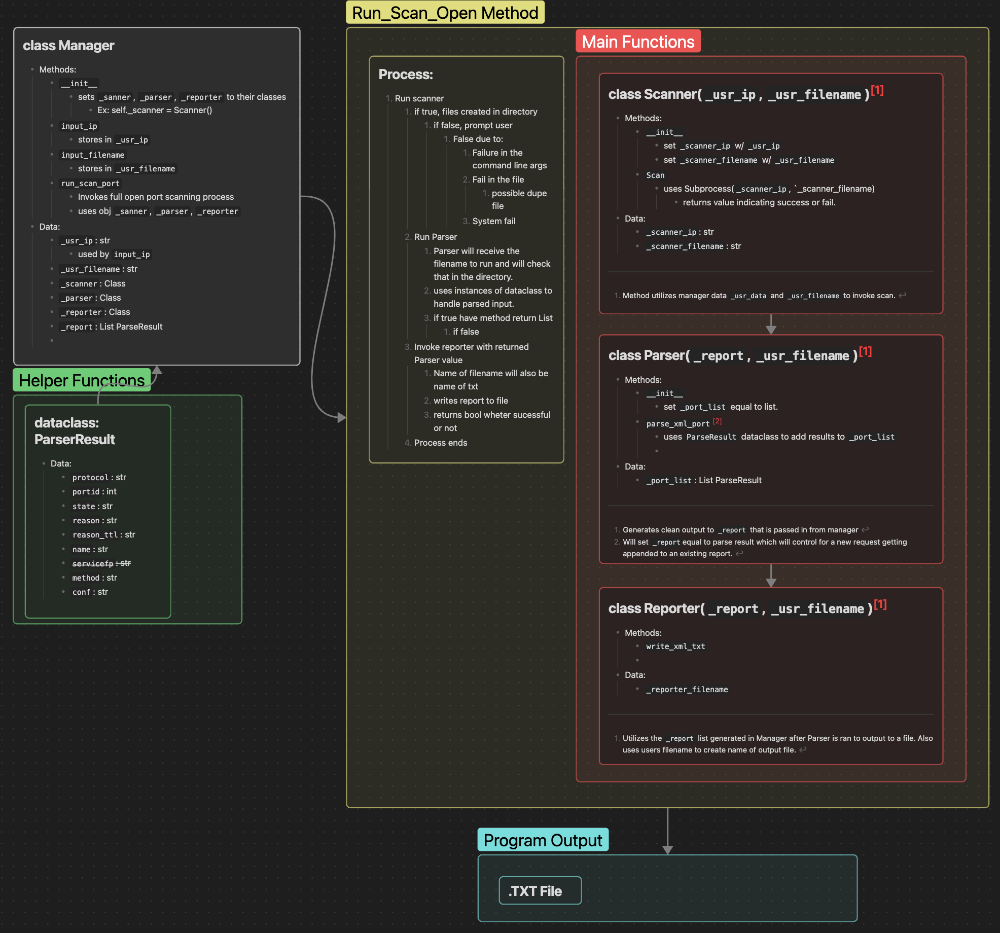

<!-- Improved compatibility of back to top link: See: https://github.com/othneildrew/Best-README-Template/pull/73 -->
<a id="readme-top"></a>
<!--
*** Thanks for checking out the Best-README-Template. If you have a suggestion
*** that would make this better, please fork the repo and create a pull request
*** or simply open an issue with the tag "enhancement".
*** Don't forget to give the project a star!
*** Thanks again! Now go create something AMAZING! :D
-->


<!-- PROJECT SHIELDS -->
<!--
*** I'm using markdown "reference style" links for readability.
*** Reference links are enclosed in brackets [ ] instead of parentheses ( ).
*** See the bottom of this document for the declaration of the reference variables
*** for contributors-url, forks-url, etc. This is an optional, concise syntax you may use.
*** https://www.markdownguide.org/basic-syntax/#reference-style-links
-->
[![Contributors][contributors-shield]][contributors-url]
[![Forks][forks-shield]][forks-url]
[![Stargazers][stars-shield]][stars-url]
[![Issues][issues-shield]][issues-url]
[![project_license][license-shield]][license-url]
[![LinkedIn][linkedin-shield]][linkedin-url]


<!-- PROJECT LOGO -->
<br />
<div align="center">
  <a href="https://github.com/nullPrivacy/NmapScanParser">
  </a>
  

<h3 align="center">Nmap Scan Parser</h3>

  <p align="center">
    Test description for project
    <br />
    <a href="https://github.com/nullPrivacy/NmapScanParser"><strong>Explore the docs »</strong></a>
    <br />
    <br />
    <a href="https://github.com/nullPrivacy/NmapScanParser">View Demo</a>
    &middot;
    <a href="https://github.com/nullPrivacy/NmapScanParser/issues/new?labels=bug&template=bug-report---.md">Report Bug</a>
    &middot;
    <a href="https://github.com/nullPrivacy/NmapScanParser/issues/new?labels=enhancement&template=feature-request---.md">Request Feature</a>
  </p>
</div>


<!-- TABLE OF CONTENTS -->
<details>
  <summary>Table of Contents</summary>
  <ol>
    <li>
      <a href="#about-the-project">About The Project</a>
    </li>
    <li>
      <a href="#getting-started">Getting Started</a>
      <ul>
        <li><a href="#prerequisites">Prerequisites</a></li>
        <li><a href="#installation">Installation</a></li>
      </ul>
    </li>
    <li><a href="#usage">Usage</a></li>
    <li><a href="#roadmap">Roadmap</a></li>
    <li><a href="#contributing">Contributing</a></li>
    <li><a href="#license">License</a></li>
    <li><a href="#contact">Contact</a></li>
    <li><a href="#acknowledgments">Acknowledgments</a></li>
  </ol>
</details>


<!-- ABOUT THE PROJECT -->
## About The Project

This project is mostly for my own interest, development, and discovery into cybersecurity tools and research. The highlights of this program pertain to concepts, tools, and insights I learned  while working on this project. My highlights include:
- Provides a shortcut to produce clean professional output of current network activity for projects, stakeholders, dashboards, or any other relevant use.
- I always wanted to know what its like to write a good script and even more so what it takes to make one that is simple and efficient. 
- Exploring unit testing with Pytest as a component of software development. I want to use this project as a stepping stone to developing consistent and robust testing alongside the software that I write. I will be exploring different methods to imitate the various methods of input necessary to test the input of my functions. Features of Pytest like monkeywrench introduce me to new libraries and features that help build upon the fundamental testing principle I have established.   
- Complete supporting documentation (Eventually). I will use this project to refine my ability to write supporting technical documents such as algorithms, process maps, flow charts, schematics, README's, testing evaluations, and anything else I may find helpful to practice and add.

## Process Map



<p align="right">(<a href="#readme-top">back to top</a>)</p>


<!-- GETTING STARTED -->
## Getting Started

To get a local copy up and running follow these simple example steps.

### Prerequisites

This is an example of how to list things you need to use the software and how to install them.
* Python
  ```sh
  brew install python
  ```

### Installation

1. Clone the repo
   ```sh
   git clone https://github.com/nullPrivacy/NmapScanParser.git
   ```
2. Go to the directory
   ```sh
   cd NmapParser
   ```
3. Run the program
   ```sh
   python3 Parser.py
   ```

<p align="right">(<a href="#readme-top">back to top</a>)</p>


<!-- USAGE EXAMPLES -->
## Usage

Use this space to show useful examples of how a project can be used. Additional screenshots, code examples and demos work well in this space. You may also link to more resources.

_For more examples, please refer to the [Documentation](https://example.com)_

<p align="right">(<a href="#readme-top">back to top</a>)</p>


<!-- ROADMAP -->
## Roadmap

- [ ] Feature 1
- [ ] Feature 2
- [ ] Feature 3
    - [ ] Nested Feature

See the [open issues](https://github.com/nullPrivacy/NmapScanParser/issues) for a full list of proposed features (and known issues).

<p align="right">(<a href="#readme-top">back to top</a>)</p>


<!-- CONTRIBUTING -->
## Contributing

Contributions are what make the open source community such an amazing place to learn, inspire, and create. Any contributions you make are **greatly appreciated**.

If you have a suggestion that would make this better, please fork the repo and create a pull request. You can also simply open an issue with the tag "enhancement".
Don't forget to give the project a star! Thanks again!

1. Fork the Project
2. Create your Feature Branch (`git checkout -b feature/AmazingFeature`)
3. Commit your Changes (`git commit -m 'Add some AmazingFeature'`)
4. Push to the Branch (`git push origin feature/AmazingFeature`)
5. Open a Pull Request

<p align="right">(<a href="#readme-top">back to top</a>)</p>

### Top contributors:

<a href="https://github.com/nullPrivacy/NmapScanParser/graphs/contributors">
  
</a>


<!-- LICENSE -->
## License

Distributed under the project_license. See `LICENSE.txt` for more information.

<p align="right">(<a href="#readme-top">back to top</a>)</p>


<!-- CONTACT -->
## Contact

James McKinley - 0xJammes@gmail.com

Project Link: [https://github.com/nullPrivacy/NmapScanParser](https://github.com/nullPrivacy/NmapScanParser)

<p align="right">(<a href="#readme-top">back to top</a>)</p>


<!-- ACKNOWLEDGMENTS -->
## Acknowledgments

* []()
* []()
* []()

<p align="right">(<a href="#readme-top">back to top</a>)</p>


<!-- MARKDOWN LINKS & IMAGES -->
<!-- https://www.markdownguide.org/basic-syntax/#reference-style-links -->
[contributors-shield]: https://img.shields.io/github/contributors/nullPrivacy/NmapScanParser.svg?style=for-the-badge
[contributors-url]: https://github.com/nullPrivacy/NmapScanParser/graphs/contributors
[forks-shield]: https://img.shields.io/github/forks/nullPrivacy/NmapScanParser.svg?style=for-the-badge
[forks-url]: https://github.com/nullPrivacy/NmapScanParser/network/members
[stars-shield]: https://img.shields.io/github/stars/nullPrivacy/NmapScanParser.svg?style=for-the-badge
[stars-url]: https://github.com/nullPrivacy/NmapScanParser/stargazers
[issues-shield]: https://img.shields.io/github/issues/nullPrivacy/NmapScanParser.svg?style=for-the-badge
[issues-url]: https://github.com/nullPrivacy/NmapScanParser/issues
[license-shield]: https://img.shields.io/github/license/nullPrivacy/NmapScanParser.svg?style=for-the-badge
[license-url]: https://github.com/nullPrivacy/NmapScanParser/blob/master/LICENSE.txt
[linkedin-shield]: https://img.shields.io/badge/-LinkedIn-black.svg?style=for-the-badge&logo=linkedin&colorB=555
[linkedin-url]: https://linkedin.com/in/james-mckinley-9ba50b1a1
[product-screenshot]: images/screenshot.png
<!-- Shields.io badges. You can a comprehensive list with many more badges at: https://github.com/inttter/md-badges -->
[Next.js]: https://img.shields.io/badge/next.js-000000?style=for-the-badge&logo=nextdotjs&logoColor=white
[Next-url]: https://nextjs.org/
[React.js]: https://img.shields.io/badge/React-20232A?style=for-the-badge&logo=react&logoColor=61DAFB
[React-url]: https://reactjs.org/
[Vue.js]: https://img.shields.io/badge/Vue.js-35495E?style=for-the-badge&logo=vuedotjs&logoColor=4FC08D
[Vue-url]: https://vuejs.org/
[Angular.io]: https://img.shields.io/badge/Angular-DD0031?style=for-the-badge&logo=angular&logoColor=white
[Angular-url]: https://angular.io/
[Svelte.dev]: https://img.shields.io/badge/Svelte-4A4A55?style=for-the-badge&logo=svelte&logoColor=FF3E00
[Svelte-url]: https://svelte.dev/
[Laravel.com]: https://img.shields.io/badge/Laravel-FF2D20?style=for-the-badge&logo=laravel&logoColor=white
[Laravel-url]: https://laravel.com
[Bootstrap.com]: https://img.shields.io/badge/Bootstrap-563D7C?style=for-the-badge&logo=bootstrap&logoColor=white
[Bootstrap-url]: https://getbootstrap.com
[JQuery.com]: https://img.shields.io/badge/jQuery-0769AD?style=for-the-badge&logo=jquery&logoColor=white
[JQuery-url]: https://jquery.com
